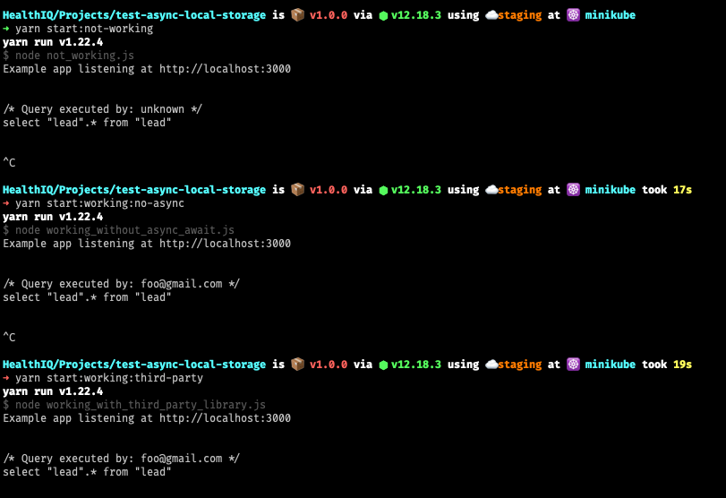

# Test Async Local Storage Implementations

This repo's only purpose is to showcase the differences between two Continuation Local Storage implementations:
Node's native `AsyncLocalStorage` implementation, and the `async-local-storage` library.

The repo contains 3 use cases:
- Using `AsyncLocalStorage` **without async/await**
- Using `AsyncLocalStorage` **with async/await**
- Using `async-local-storage` **with async/await**

### Requirements

- Node v12.17 or above (older versions do not include `AsyncLocalStorage` or have it as an experimental feature).

#### What the examples do

All 3 examples do the exact same thing. They setup a simple Express web server in port 3000 that exposes a single
route `/` that, when accessed, reads all leads in the `lead` table of a `hiq_crm` database. All examples use Knex
to query the database.

#### What it intends to show

The idea behind this bit of code is to show how the different implementations of CLS react to this use case (which is
pretty much what we're aiming to achieve ourselves), which is, how to maintain CLS context inside Knex's `query-response`
event listener, so that we may access the current logged in user.

#### Running the examples

Each example has its own npm script defined:
- `start:working:no-async` - Using `AsyncLocalStorage` **without async/await**
- `"start:not-working` - Using `AsyncLocalStorage` **with async/await**
- `start:working:third-party` - Using `async-local-storage` **with async/await**

#### What to expect from the results

If you run all three examples shown above, you should see the following results (could be in a different order of course):

This shows how 2 of the examples work as expected while the one using `AsyncLocalStorage` and `async/await` does not.